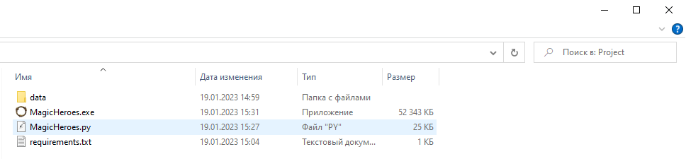
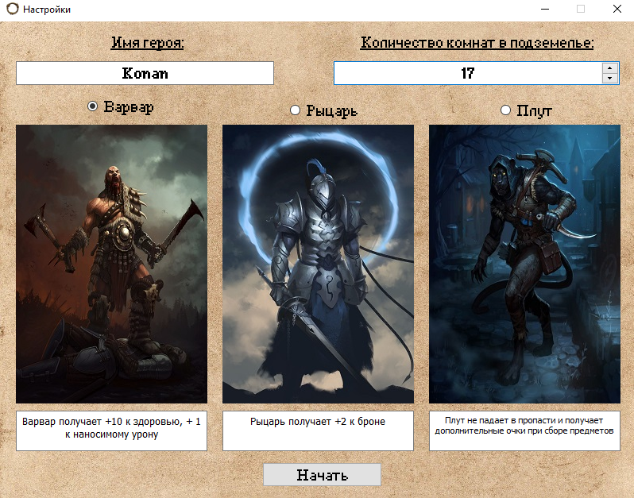
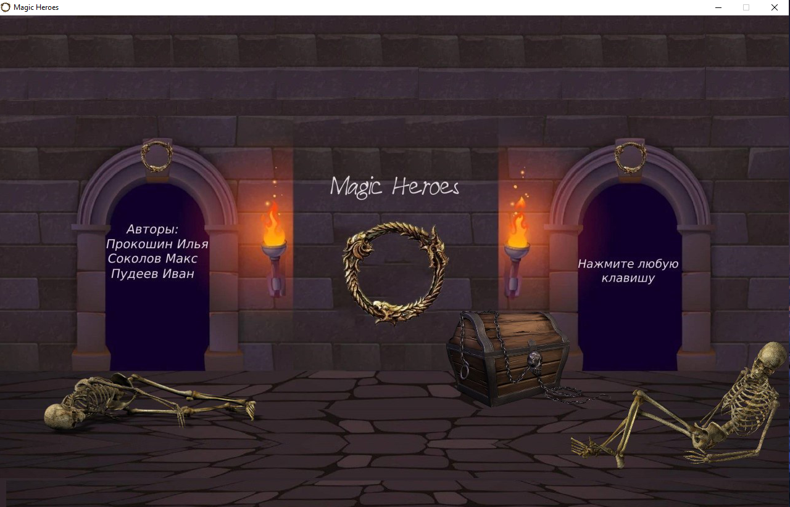

## Добро пожаловать в Magic Heroes!
#### Magic Heroes - это игра на классическом клетчатом поле, написанная на языке Python с использованием библиотек pygame и PyQT5. 

Данная игра является совместным проектом трёх учеников **Лицея Академии Яндекса** - *Ильи Прокошина*, *Максима Соколова* и *Ивана Пудеева*.

Объём кода - около **760** строк (**700** без учёта комментариев). В коде использованы различные средства языка Python (**ООП**, различные **области видимости переменных**, вызовы **функций**, работа с **библиотеками**, в частности, использование **sprite**-ов и **обработка столкновений** при помощи **pygame**). 

### В ходе работы роли были распределены следующим образом:

* **Максим Соколов** - графическое оформление;
* **Илья Прокошин** - координация действий, программирование;
* **Иван Пудеев** - программирование, генерация идей.

*P.S. Надеемся на высокую оценку ;)*

## Рекомендуем ознакомиться с Правилами игры для лучшего игрового опыта:

* **Цель** игрока -  пройти подземелье, полное монстров, сокровищ, пропастей и различных колдовских зелий, набрав при этом максимально возможное количество очков.
* Первое, на что стоит обратить внимание - **создание Вашего персонажа**. Экран создания персонажа появится при запуске игры. Особенности каждого **класса** героя указаны прямо под его портретом. В этом окне также можно выбрать количество комнат (чем больше, тем больше очков можно набрать), указать имя персонажа, а ещё здесь располагается запись о *самом удачливом и умелом авантюристе*, прошедшем подземелье лучше всех остальных.

# ***Условные обозначения***:

* **Дверью** обозначен переход в **другую комнату**.
* **Синяя колба** обозначает **зелье**. Зелья бывают трёх различных видов: **восстанавливающие здоровье, наносящие персонажу урон и увеличивающие его силу**. Употребляйте на свой страх и риск!
* **Жёлтая колба** - **амброзия**. Она - лучший выбор для тех авантюристов, которые нуждаются в **восстановлении здоровья**. Просто берите её, когда это необходимо, и всё будет в порядке!
* **Другие персонажи на карте** - это всегда **противники*. Лицо близкого друга в тёмном и мрачном подземелье увидеть, увы, не получится. Поэтому Вам и нужно отсюда выбраться, разве нет?
* **Пропасти**. Огромные провалы в полу. Наверняка Вы НЕ захотите в них падать. Но если Ваш персонаж - плут, Вам на них всё равно.
* **Золотой кубок** - это **древний артефакт**. Возьмите его как можно скорее - он ощутимо **усилит Вашего персонажа** и добавит Вам **дополнительные очки**!
* **Руины**. Просто **непроходимые** старые развалины.
* **Металлический нагрудник** - это верный спутник героев, которые не желают погибнуть совсем не героической смертью от отравления тяжёлыми металлами, вроде клинков и стрел противников. Сбор таких сделает Вас **крепче**.

***

### Желаем Вам приятной игры.