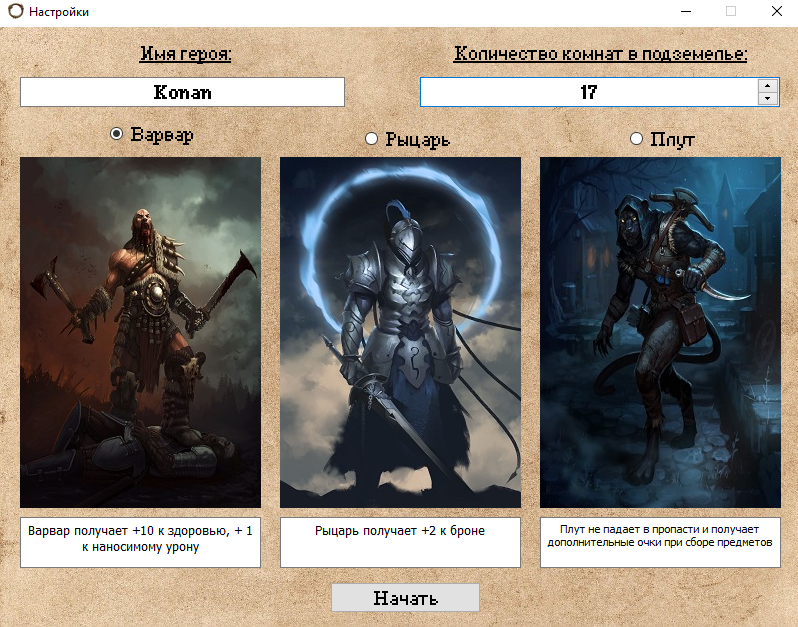
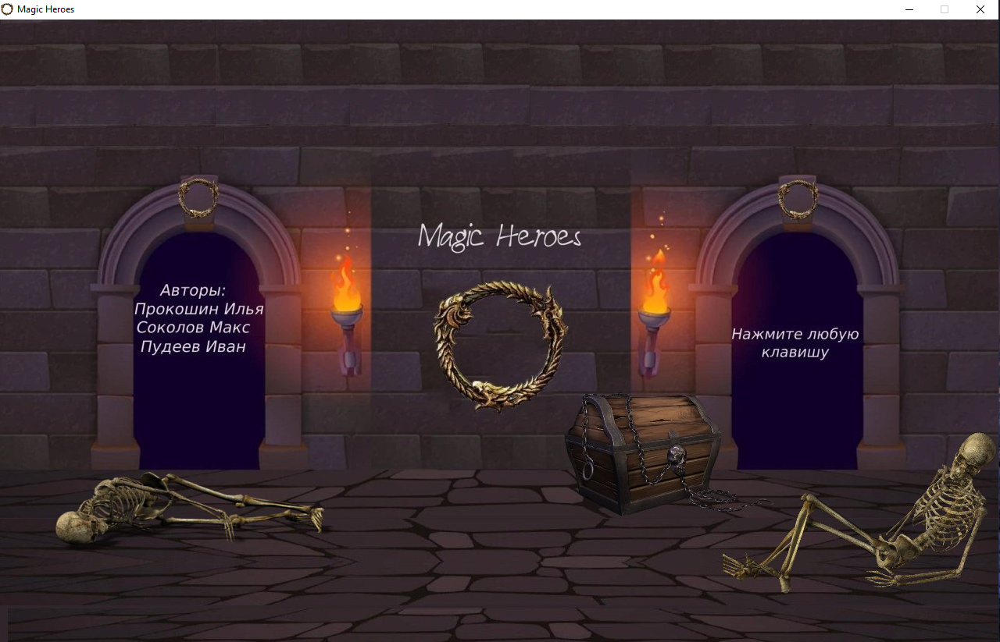

## Добро пожаловать в Magic Heroes!
#### Magic Heroes - это игра на классическом клетчатом поле, написанная на языке Python с использованием библиотек pygame и PyQT5. 

Данная игра является совместным проектом трёх учеников **Лицея Академии Яндекса** - *Ильи Прокошина*, *Максима Соколова* и *Ивана Пудеева*.

Объём кода - около **650** строк (**600** без учёта комментариев). В коде использованы различные средства языка Python (**ООП**, различные **области видимости переменных**, вызовы **функций**). 

### В ходе работы роли были распределены следующим образом:

* **Максим Соколов** - графическое оформление;
* **Илья Прокошин** - координация действий, программирование;
* **Иван Пудеев** - программирование, генерация идей.

*P.S. Надеемся на высокую оценку ;)*

### Желаем Вам приятной игры.